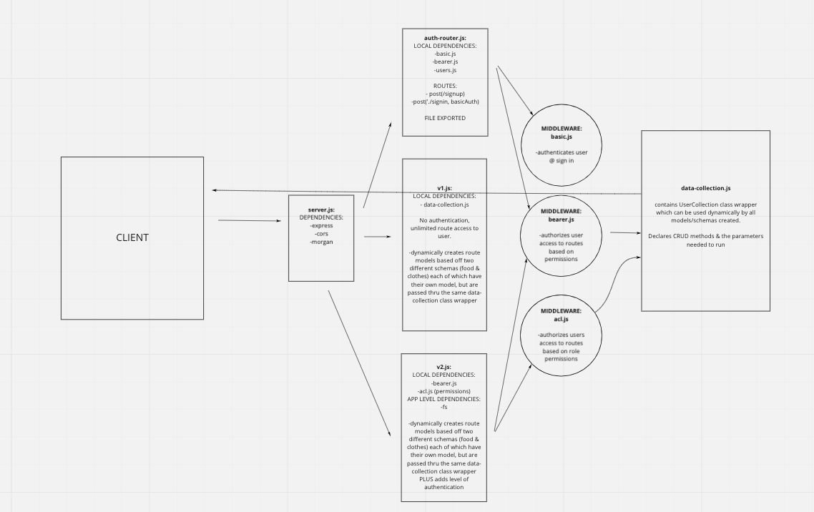

# Lab 08: Auth-API Server
Authentication and API server merged into one.  Built with modularization in mind.  Different versions of routes: autheticated and non-authenticated routes created.

## Links and Resources
[Pull Requests](https://github.com/thornrae/auth-api/pulls)

[CI/CD](https://github.com/thornrae/auth-api/tree/main/.github/workflows)

[Heroku Deployment](https://auth-api-401.herokuapp.com/)

## Set Up
- Clone this repo
- Create local .env file
- Assign: PORT
- Assign: local SECRET
- Connect: mongooseDB - for the use of this project, name your database whatever comes to mind

## Initialize 
Install these dependecies:
- Base-64
- Bcrypt
- Cors
- Dotenv
- Express
- FS
- Jest
- Jsonwebtoken
- Mongoose
- Morgan

## UML

